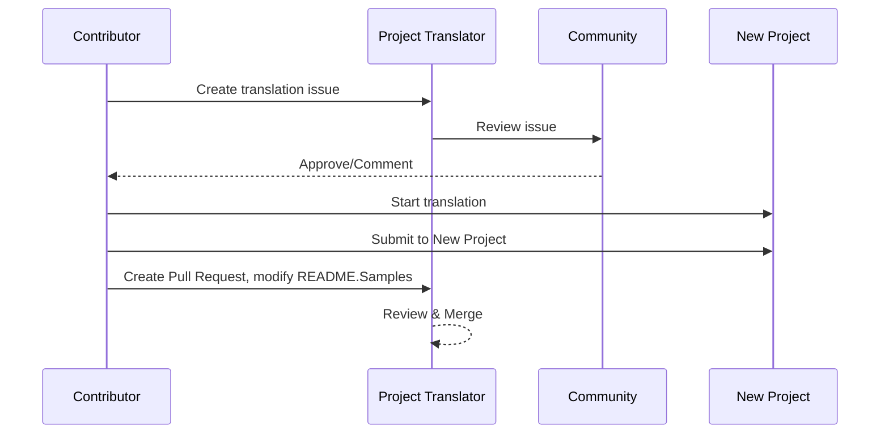

# Project Translator

A VSCode extension: An easy-to-use tool for multi-language localization of projects.

## Samples

| Project                                                   | Languages                                                                                                                               |
| --------------------------------------------------------- | --------------------------------------------------------------------------------------------------------------------------------------- |
| [google/styleguide](https://github.com/google/styleguide) | [en-us](https://github.com/google/styleguide) origin by @google<br>[zh-cn](https://github.com/Project-Translation/styleguide-zh-cn) translate by @jqknono |

## Requesting Project Translation

If you want to contribute a translation or need a project to be translated:

1. Create an issue using the following template:

```md
**Project**: [project_url]
**Target Language**: [target_lang]
**Description**: Brief description of why this translation would be valuable
```

2. Workflow:



3. After the PR is merged, the translation will be added to the Samples section.

Current translations in progress: [View Issues](https://github.com/jqknono/project_translator/issues)

## Features

- 🌍 Support for Multiple Target Languages

- 💡 Smart Translation with AI

  - Automatically maintains code structure integrity
  - Only translates code comments, preserves code logic
  - Maintains JSON/XML and other data structure formats
  - Professional technical documentation translation quality

- ⚙️ Flexible Configuration

  - Configure source folder and multiple target folders
  - Support for custom file translation intervals
  - Set specific file types to ignore
  - Support for multiple AI model options

- 🚀 User-Friendly Operations
  - Real-time translation progress display
  - Support for pause/resume/stop translation
  - Automatic maintenance of target folder structure
  - Incremental translation to avoid duplicate work

## Installation

1. Search for "[Project Translator](https://marketplace.visualstudio.com/items?itemName=techfetch-dev.project-translator)" in VS Code extension marketplace
2. Click install

## Configuration

The extension supports the following configuration options:

```json
{
  "projectTranslator.sourceFolder": "Source folder path",
  "projectTranslator.destFolders": [
    {
      "path": "Target folder path",
      "lang": "Target language code"
    }
  ],
  "projectTranslator.currentVendor": "openai",
  "projectTranslator.vendors": [
    {
      "name": "openai",
      "apiEndpoint": "API endpoint URL",
      "apiKey": "API authentication key",
      "model": "Model name to use",
      "rpm": "Maximum requests per minute",
      "maxTokensPerSegment": 4096,
      "timeout": 30,
      "temperature": 0.0
    }
  ]
}
```

Key configuration details:

| Configuration Option                            | Description                                                                                                           |
| ----------------------------------------------- | --------------------------------------------------------------------------------------------------------------------- |
| `projectTranslator.sourceFolder`                | Source folder path                                                                                                    |
| `projectTranslator.destFolders`                 | Translation target folder configuration, can specify multiple target folders and their corresponding target languages |
| `projectTranslator.translationIntervalDays`     | Translation interval in days (default 7 days)                                                                         |
| `projectTranslator.ignoreTranslationExtensions` | List of text file extensions that don't need translation, these files will be copied directly                         |
| `projectTranslator.ignorePaths`                 | List of ignored path patterns using wildcards, these files won't be copied                                            |
| `projectTranslator.currentVendor`               | Current API vendor in use                                                                                             |
| `projectTranslator.vendors`                     | API vendor configuration list                                                                                         |
| `projectTranslator.systemPrompts`               | System prompt array for guiding the translation process                                                               |
| `projectTranslator.userPrompts`                 | User-defined prompt array, these prompts will be added after system prompts during translation                        |
| `projectTranslator.segmentationMarkers`         | Segmentation markers configured by file type, supports regular expressions                                            |

## Usage

1. Open command palette (Ctrl+Shift+P / Cmd+Shift+P)
2. Type "Translate Project" and select the command
3. If source folder is not configured, a folder selection dialog will appear
4. Wait for translation to complete

During translation:

- Can pause/resume translation via status bar buttons
- Can stop translation process at any time
- Translation progress shown in notification area
- Detailed logs displayed in output panel

## Notes

- Ensure sufficient API usage quota
- Recommended to test with small projects first
- Use dedicated API keys and remove them after completion

## License

[License](LICENSE)
